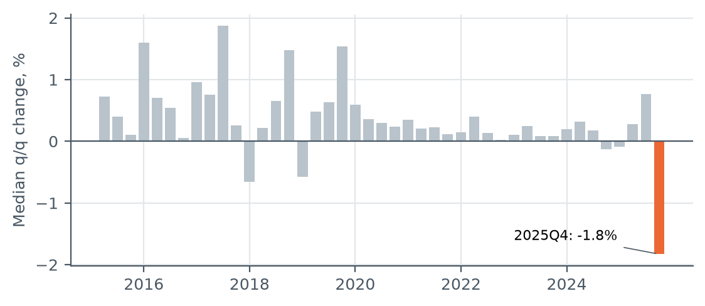
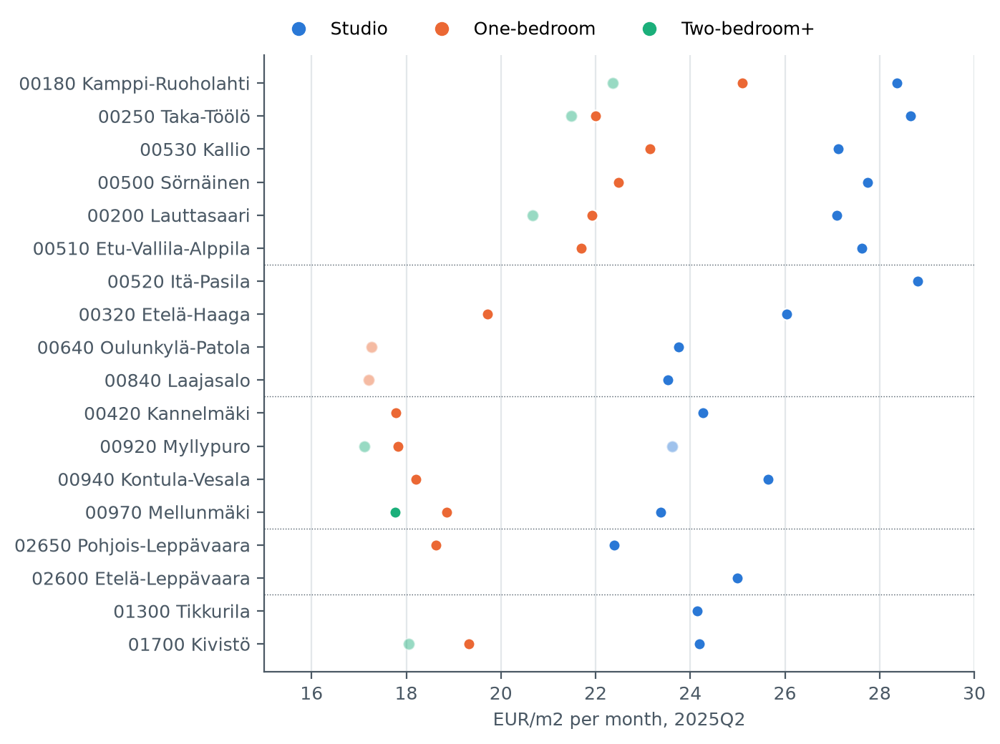
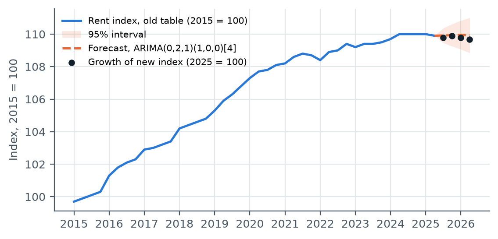
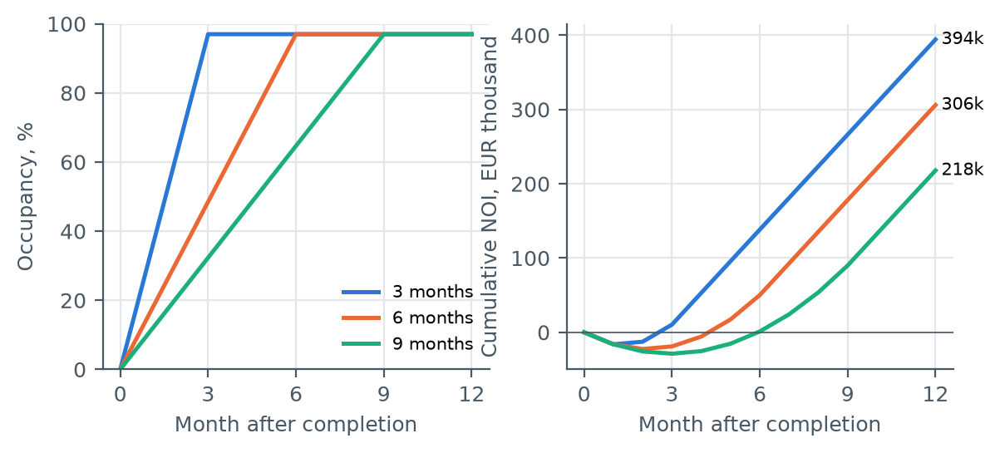
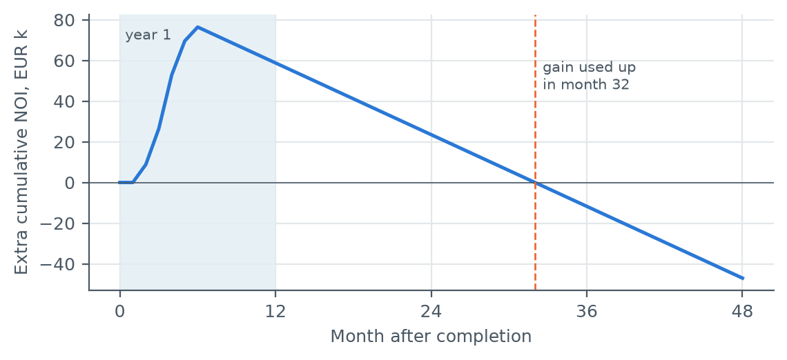

# Helsinki rental market benchmark and lease-up model

A benchmark of free-market rents in Helsinki, Espoo and Vantaa, a rent forecast, and an Excel model of how letting speed affects a new rental building's first-year income. Built from open Statistics Finland data.

The building in the model is hypothetical. Nothing here is a valuation of a real property or fund.

## Contents

- [Questions](#questions)
- [Key findings](#key-findings)
- [Terms used](#terms-used)
- [Data](#data)
- [Part 1: rent benchmark](#part-1-rent-benchmark)
- [Part 2: rent forecast](#part-2-rent-forecast)
- [Part 3: lease-up model](#part-3-lease-up-model)
- [Using the workbook](#using-the-workbook)
- [How the work was checked](#how-the-work-was-checked)
- [Limitations](#limitations)
- [Repository structure and how to reproduce](#repository-structure-and-how-to-reproduce)

## Questions

1. **What is the market rent?** Free-market rent in €/m² for 18 postal areas, by flat size, with 1-year and 5-year changes.
2. **Where are rents heading?** A Box-Jenkins ARIMA forecast of Helsinki rent, checked against what actually happened.
3. **How much does lease-up speed matter?** First-year net operating income (NOI) of a hypothetical 70-flat building when it takes 3, 6 or 9 months to let, and whether cutting rent to let faster pays off.

## Key findings

- **Rent levels.** Free-market rents run from about 17 to 29 €/m² a month. Studios cost the most per m² in every area. Helsinki rent for new leases was 22.04 €/m² in 2026Q2.
- **Rent growth was slow.** Like-for-like rents rose 1.3% a year in 2015-2021 and 0.3% a year after that. The average €/m² rose much faster, because newer, more expensive flats entered the data and the series has a one-off break in 2017Q3.
- **The forecast.** A trend model of the average rent forecast +2.1% for the year to 2026Q2. Rents were flat (-0.2%). A model of the like-for-like index forecast +0.0%. Choosing the right measure mattered more than choosing the ARIMA model.
- **Lease-up.** Each extra month of lease-up costs half a month of the building's stabilised rent, about €29,000 here. Letting in 9 months instead of 3 loses €176,000 of first-year NOI, 34.5% of a full year.
- **Cut rent or wait?** In year one, speed beats price: letting in 3 months instead of 6 is worth up to a 15% rent cut. But a discount usually stays in the lease, and a 5% cut's year-one gain is used up 20 months later. The answer depends on how much faster a lower rent really lets and how long the discount lasts.
- **Data gaps.** Statistics Finland hides 45% of capital-region postal-code cells. Areas with many institutional landlords, where new build-to-rent buildings tend to be, are the most likely to be hidden.

## Terms used

| Term | Meaning |
|---|---|
| Free-market (vapaarahoitteinen) flat | Privately financed rental flat. The landlord sets the rent. The alternative, ARA flats, are state-subsidised with regulated rents. Only free-market data is used here. |
| Build-to-rent | A building developed to be owned and let as a whole by one investor. |
| Occupancy | Share of flats that are let. *Stabilised occupancy* is the normal long-run level after lease-up, below 100% because tenants move out. |
| Lease-up | The months after completion when a new building fills with tenants. |
| NOI, net operating income | Rent received minus the owner's operating costs, before financing and tax. |
| Yield | NOI divided by value. At a 4.3% yield, a building is worth about 23 times its annual NOI. |
| Like-for-like rent change | Change in the rent of the same flats over time. Statistics Finland's rent index measures this. An average €/m² also moves when the mix of flats in the data changes. |
| Price zones | Statistics Finland splits Helsinki into four zones by price level. Zone 1 is the most expensive. |

## Data

All market data: [Statistics Finland, rents of dwellings](https://stat.fi/tilasto/asvu), CC BY 4.0, fetched from the PxWeb API on 8 October 2026. The raw responses are saved untouched in `data/raw/`.

| Table | Content |
|---|---|
| [13eb](https://pxdata.stat.fi/PxWeb/api/v1/fi/StatFin_Passiivi/asvu/statfinpas_asvu_pxt_13eb_2025q4.px) (archived) | Free-market average rent €/m² by postal code and flat size, 2015Q1-2025Q4 |
| [11x4](https://pxdata.stat.fi/PxWeb/api/v1/fi/StatFin_Passiivi/asvu/statfinpas_asvu_pxt_11x4_2025q4.px) (archived) | Rent index (2015=100) and average €/m² by area, 2015Q1-2025Q4 |
| [15fa](https://pxdata.stat.fi/PxWeb/api/v1/fi/StatFin/asvu/15fa.px) (current) | Rent index (2025=100) and average €/m² incl. new leases, 2025Q1-2026Q2 |

The lease-up model's assumptions come from public market sources: the Rakli-Taaleri paper *Residential Market in Finland* (January 2026), KTI *The Finnish Property Market 2026*, JLL *Finland Residential Market Dynamics Q1 2026*, Kojamo's 2025 financial statements and Statistics Finland's housing company cost statistics. Every number, source and decision, with dates, is in [`notes/assumptions_and_sources.md`](notes/assumptions_and_sources.md).

### Three data problems, found before any analysis

**1. The old and new tables cannot be joined.** In 2025 Statistics Finland changed the statistics: water fees no longer count as rent, the weights were updated and asking rents from listings were added. For the same quarter, the new table is about 1 €/m² lower. Long series therefore use the old tables only, and current levels the new one only. The switch from a geometric to an arithmetic mean cannot explain the gap, because an arithmetic mean of the same data would be higher, not lower.

**2. The last two quarters of the old tables are unreliable.** Across all postal codes the typical quarterly change is between -1% and +2%. In 2025Q4 it drops 1.8%, and 8.2% for one-bedroom flats, while the new table shows flat rents. Statistics Finland also corrected the 2025Q3 release. The benchmark quarter is 2025Q2, the last one before the break.



**3. Many cells are hidden.** Statistics Finland does not publish a postal-code figure when there are fewer than 20 leases, or when rental companies own a large share of the area. Most two-bedroom+ cells are hidden. The gaps are shown openly, and a figure here needs at least 30 leases in every quarter it uses.

## Part 1: rent benchmark

18 postal areas (14 in Helsinki, 2 in Espoo, 2 in Vantaa), chosen for data coverage and a spread from the centre to newer districts. For each area and flat size: the 2025Q2 rent, and the change on the same quarter one and five years earlier.



Studios rent for the most per m² everywhere, because fixed parts of a flat (kitchen, bathroom) are spread over fewer square metres. The inner city is 3 to 5 €/m² above the outer suburbs for studios and up to 8 €/m² for one-bedroom flats. Five-year changes of the averages should be read with care, because the averages move when newer flats enter the data. Like-for-like, Helsinki rents rose only 2.0% in the five years to 2025Q2.

## Part 2: rent forecast

The Helsinki free-market average rent (42 quarters, 2015Q1-2025Q2) was forecast in R with the Box-Jenkins steps:

1. **Plot.** Upward trend, no seasonal pattern, one jump in 2017Q3.
2. **Stationarity.** ADF and KPSS tests: the level is not stationary, the quarterly change is.
3. **ACF and PACF.** No autocorrelation left after one difference.
4. **Candidate models.** 72 ARIMA models with and without seasonal terms and drift.
5. **Model choice.** Lowest AICc: a random walk with drift, ARIMA(0,1,0). R's `auto.arima` and BIC pick the same model.
6. **Residual checks.** Ljung-Box finds no autocorrelation. The residuals are not normal, mainly because of the 2017Q3 jump, so bootstrapped intervals were checked too.
7. **Validation.** Fitted on data up to 2024Q2, the model's error on the last four quarters (MAPE) was 0.96%. Simply repeating the last value scored 0.46%.

The forecast quarters have already happened, so the forecast could be checked against the new table.

| Model | Forecast growth to 2026Q2 | Actual |
|---|---|---|
| Average rent: random walk with drift | +2.1% | -0.1% |
| Average rent: same, plus a 2017Q3 level shift | +1.7% | -0.1% |
| Like-for-like index: random walk with drift | +0.9% | -0.2% |
| Like-for-like index: ARIMA(0,2,1)(1,0,0)[4] | +0.0% | -0.2% |



**Why the average overshot.** The average rose 27.8% from 2015 to 2025, while like-for-like rents rose 10.2%. A constant drift learns that extra rise as if it were rent growth. Part of it is a one-off break in 2017Q3: the average jumps in every area while the index barely moves and the number of observations falls, which looks like a change in how the averages were calculated. Growth also slowed, from 1.3% a year before 2022 to 0.3% after, and the noise in the series fell about threefold.

**Two judgement calls.** The 2017Q3 level-shift model has a much better AICc, but it is reported only as a check. The dummy was placed on the largest residual after seeing it, so its better score is not a fair comparison. The index model was also chosen after the outcome was known, so its good result supports the explanation above but does not prove it.

**What this means for Part 3.** The lease-up model assumes flat rents in year one.

## Part 3: lease-up model

A hypothetical new building with 70 flats in Helsinki price zone 2:

| Flat type | Flats | Size | Rent (new leases, zone 2, 2026Q2) |
|---|---|---|---|
| Studio | 28 | 26 m² | 26.33 €/m² |
| One-bedroom | 28 | 40 m² | 21.65 €/m² |
| Two-bedroom+ | 14 | 60 m² | 20.45 €/m² |

| Assumption | Base | Basis |
|---|---|---|
| Stabilised occupancy | 97% (94% tested) | Kojamo's valuation uses 97.5%. The market today is 93.4% (KTI). |
| Lease-up | Linear, over 3, 6 or 9 months | Assumption |
| Incentive | 1 free month per new lease | Assumption. JLL notes incentives are widely used. |
| Operating costs | €6.00/m²/month on every flat, let or empty | Assumption. Kojamo uses 6.75 for older stock, Statistics Finland reports 6.17 for housing companies. |
| Rent growth in year one | 0% (+2.1% tested) | Part 2 |
| Valuation yield | 4.3% (4.0-5.0% tested) | Helsinki prime residential yield (Catella, JLL). Kojamo uses 4.22%. |

Each month, occupancy rises in equal steps until it reaches 97%. Rent comes in only from let flats, but operating costs are paid on all of them.



| Year one | 3 months | 6 months | 9 months |
|---|---|---|---|
| NOI | €394,228 | €306,064 | €217,899 |
| Share of a stabilised year (€511,781) | 77.0% | 59.8% | 42.6% |

**Why each month costs half a month of rent.** With a linear lease-up over T months, the year's occupancy adds up to 12 - (T-1)/2 months of full occupancy. Each extra month of lease-up therefore removes exactly half a month of stabilised rent: €60,594 × 97% / 2 = €29,388. The free month costs the same in every scenario, because the same number of leases is signed in year one.

**Cut rent or wait?** Operating costs are the same whether the building fills fast or slowly, so they cancel out when comparing a rent cut with a slower lease-up. Letting in 3 months instead of 6 is worth up to a 15% rent cut in year one. The catch is that Finnish leases usually run until further notice, so a discount can stay in the lease. A 5% cut gains €58,776 in year one and costs €2,939 a month after that, so the gain is used up 20 months after year one. If the cut were permanent, it would lower the indicative value by about €0.8 million.



The model cannot say how much faster a lower rent actually fills a building. No public data measures that. What it shows is the bar a rent cut has to clear, a question for real leasing data.

**Value check.** At a 4.3% yield, stabilised NOI of €511,781 gives an indicative value of €11.9 million, about €4,430/m². A real appraisal would use a 10-year cash flow.

## Using the workbook

`output/Helsinki_Rental_Benchmark.xlsx` recalculates fully in Excel. Yellow cells are inputs, everything else is a formula.

| Sheet | What it does |
|---|---|
| Inputs | Flat mix, rents linked to the Current rents sheet, every assumption with its source. Named cells such as `Stab_occ`, `Opex_m2` and `Yield_val` keep the formulas readable. |
| Lease-up model | Months 1-12 across, three scenarios down: occupancy, let flats, new leases, rent, incentives, costs, NOI. |
| Sensitivity | Year-one NOI for lease-up time × rent level, the breakeven rent cut, the cost after year one, and value at different yields. |
| Charts | Occupancy, cumulative NOI and year-one NOI by scenario. |
| Benchmark summary | The 18 areas by flat size. Change the quarter or the minimum observations and the table updates. |
| Benchmark data | All quarterly postal-code rows, ready for a pivot table (steps in [`notes/pivot_table_steps.md`](notes/pivot_table_steps.md)). |
| Area trend, Current rents, Sources | Index by price zone, latest rents incl. new leases, and data sources. |

`output/Helsinki_Rental_Benchmark.pptx` has four slides with speaker notes.

## How the work was checked

- Every Excel formula result was recalculated in Excel and compared with an independent Python calculation. They matched to the cent. Changing inputs updated every output.
- The forecast was checked against the actual outcome, not only against held-out data.
- An external review raised several points. All but one were correct and were fixed. The main one: growth figures had used the average rent, not the like-for-like index.
- The whole project was then replayed step by step, with every decision logged. That found five more issues, all fixed and documented in `notes/assumptions_and_sources.md`.

## Limitations

- 42 quarterly observations is a short series, and the forecast has no explanatory variables such as interest rates or new supply.
- Statistics Finland's averages cover all leases in force, not only new ones, and the postal-code averages are not quality-adjusted.
- The lease-up model is linear, covers year one only, treats all operating costs as fixed and does not know how much faster a lower rent lets a building.
- The yield and the lease-up time are the largest sensitivities. Both are tested as ranges.

## Repository structure and how to reproduce

```
data/raw/          untouched API responses, dated
data/processed/    clean tables, benchmark and forecast results
src/               scripts, run in order
output/            workbook, slides and charts
notes/             assumptions and sources log, pivot table steps
```

Requires Python 3.13 and R 4.6 with the `forecast` and `tseries` packages. From the project folder (Windows):

```
python -m venv .venv
.venv\Scripts\python.exe -m pip install -r requirements.txt
.venv\Scripts\python.exe src\01_fetch_statfin.py
.venv\Scripts\python.exe src\02_clean.py
.venv\Scripts\python.exe src\02b_benchmark.py
Rscript src\03_forecast.R
.venv\Scripts\python.exe src\04_build_model.py
.venv\Scripts\python.exe src\05_report_figures.py
.venv\Scripts\python.exe src\06_build_slides.py
```

`01_fetch_statfin.py` downloads fresh data with today's date, so results can change as Statistics Finland updates its tables.

Built with Python (pandas, statsmodels, openpyxl, python-pptx, matplotlib), R (forecast, tseries) and Excel, using Claude Code.

Author: Albin Oruglica, Aalto University.
